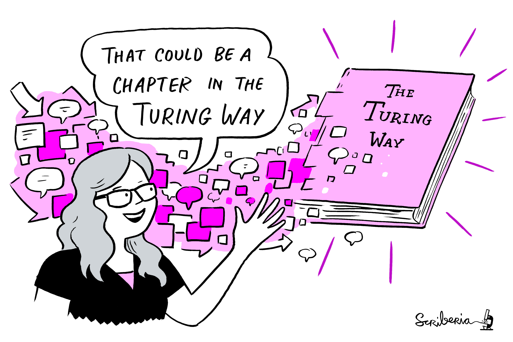

(ch-acknowledgement)=
# Acknowledging Contributors

_The Turing Way_ is collaboratively developed by its diverse community of researchers, learners, educators, and other stakeholders.
This project can simply not exist without the collaborative nature of this project and the willingness of our community members to work cooperatively in this book.
We value all kinds of contributions in this project and are committed to recognising each of them fairly.

Everyone has a skill that is useful for someone, and therefore anyone can contribute to _The Turing Way_.

<!---
|  |
|----------|
| “That could be a chapter” - Kirstie Whitaker, _The Turing Way_ project illustration by Scriberia. Zenodo. http://doi.org/10.5281/zenodo.3695300 |
--->

```{figure} ../figures/ThatCouldBeAChapter.png
---
height: 400px
name: ThatCouldBeAChapter
alt: A sketch of Kirstie saying “That could be a chapter”
---
“That could be a chapter” - Kirstie Whitaker, _The Turing Way_ project illustration by Scriberia. Zenodo. http://doi.org/10.5281/zenodo.3695300
```

We recognise all kinds of contributions that are possible in this project.
We update our {ref}`Contributors Table<aw-contributors-record-contributors>` by appropriately acknowledging our contributors' work within _The Turing Way_.
Furthermore, we invite every contributor to update the {ref}`Record of Contributions<aw-contributors-record-highlights>` with their personal highlights.

In this chapter, we provide details on the following aspects:
- who our contributors and community members are
- how we create opportunities for a shared ownership of this project
- how we can use record of contributions to highlight work of our community members
- what the different types and possible pathways for contributions exist in _The Turing Way_
